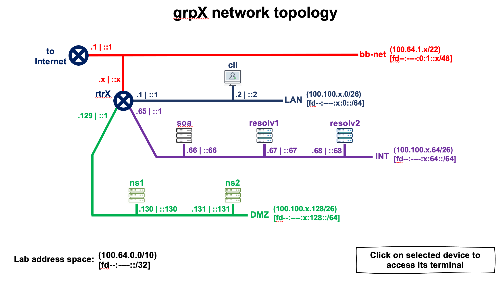

# Technical Engagement DNS Lab

Welcome to the DNS lab of ICANNs Technical Engagement Team!

To participate in this lab you will need to bring 
your own laptop, some - but not much - DNS knowledge
and a good mood.

> [!TIP] 
> Experience with the linux command line is a plus.  

The lab consists of a number of presentations that will explain
parts of the DNS ecosystem and a number of practical hands-on labs.

# Lab environment

Every participant in the lab gets their own lab environment

Your instructor will announce the **lab domain**.

Your instructor will give you a **group number**. 

> [!IMPORTANT]
>
> In all this lab, be carefull to always replace ***X*** by your group
> number in IP addresses, server name and any other place where
> required. Same for \<lab domain\> to be replace by the domain name 
> registered for the class.

Your domain: grpX.\<lab domain\>

Every participant gets a number of virtual machines. The machines are placed in different networks.

|  Device Name  |     IPv4 Address      |       IPv6 Address          | 
| ------------- | --------------------- | --------------------------- |
| cli           | 100.100.X.2 (eth0)    | fd73:7c99:X::2 (eth0)       |
| resolv1       | 100.100.X.67 (eth0)   | fd73:7c99:X:64::67 (eth0)   |
| resolv2       | 100.100.X.68 (eth0)   | fd73:7c99:X:64::68 (eth0)   |
| soa           | 100.100.X.66 (eth0)   | fd73:7c99:X:64::66 (eth0)   |
| ns1           | 100.100.X.130 (eth0)  | fd73:7c99:X:128::130 (eth0) |
| ns2           | 100.100.X.131 (eth0)  | fd73:7c99:X:128::131 (eth0) |

