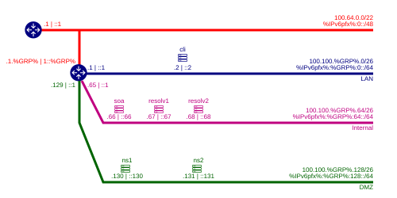

# Technical Engagement DNS Lab

Welcome to the DNS lab of ICANNs Technical Engagement Team!

To participate in this lab you will need 

- to bring your own laptop
- some DNS knowledge
- some experience with the Linux command line

> [!TIP] 
> Bring a good mood with you. :grin:

The lab consists of a number of presentations that will explain
parts of the DNS ecosystem and a number of practical hands-on labs.

# License

This repository is licensed under [Creative Commons Attribution 4.0 International](https://creativecommons.org/licenses/by/4.0)

For details please see [License.md](License.md)

# Lab environment

Every participant in the lab gets their own lab environment. 

Your group: %GRP%

Your domain: grp%GRP%.%DOMAIN%

Every participant gets a number of virtual machines. The machines are placed in different networks.

We use the private 100.64.0.0/10 address space from [RFC 6598](https://www.rfc-editor.org/rfc/rfc6598).

| Device Name   | IPv4 Address          | IPv6 Address                | Network  |
| ------------- | --------------------- | --------------------------- | -------- |
| cli           | 100.100.%GRP%.2     | %IPv6pfx%:%GRP%::2        | lan      |
| resolv1       | 100.100.%GRP%.67    | %IPv6pfx%:%GRP%:64::67    | internal |
| resolv2       | 100.100.%GRP%.68    | %IPv6pfx%:%GRP%:64::68    | internal |
| soa           | 100.100.%GRP%.66    | %IPv6pfx%:%GRP%:64::66    | internal |
| ns1           | 100.100.%GRP%.130   | %IPv6pfx%:%GRP%:128::130  | external |
| ns2           | 100.100.%GRP%.131   | %IPv6pfx%:%GRP%:128::131  | external |

# Here be Dragons

Please don't skip any of the labs as they build on each other. 

> [!WARNING]
> Later labs will likely fail if you didn't finish the earlier ones!

> [!WARNING]
> Any configuration in this lab is not ready for production systems.

{:toc}

# Roadmap
- ZONEMD
- RPZ
- Catalog Zones
- Pre Delegation Testing
- PowerDNS / Recursor
- Knot DNS / Resolver
